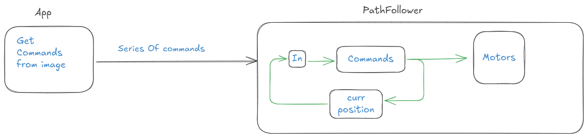

# RobotMechi: Un robot autonome

RobotMechi est un robot autonome qui interprète une série de commandes et suit un chemin spécifié. Voici une description détaillée de ses composants et fonctionnalités.

## Architecture du système 


## Exemple de commande d'entrée

bash
forward : 100m
Right : 90°
forward : 100m
Right   :90°
forward :100m
Left :90°


Avec cette série de mouvements, le robot crée un chemin. Le système est divisé en deux parties principales :

### Matériel
- **Moteurs avec encodeurs** : Pour contrôler le mouvement et mesurer la position.
- **Capteurs** :
  - Accéléromètre
  - Gyroscope
- **Microcontrôleur** :
  - Le STM32F4 est utilisé comme MCU principal.
  - Contrôle la vitesse et l'orientation des moteurs à l'aide de PWM et d'un minuteur.
  - Reçoit des retours de position via les encodeurs.

### Système de contrôle
- **Boucle de rétroaction fermée** : Garantit la vitesse et l'orientation correctes à l'aide des données de l'accéléromètre et du gyroscope.

---

## Communication entre App et PathFollower

L'application envoie la série de commandes, et le système PathFollower les reçoit. Les options de communication incluent :

- **UART** : Le MCU est connecté à l'ordinateur portable via un port série.
- **MQTT** : L'application publie les commandes au format JSON sur un sujet. Le PathFollower s'abonne à ce sujet pour recevoir les commandes.

---

## PINOUTs 
### LED
- Internal LED  PA5 
### PONT-H 
- IN1 PB3  (D3)	
- IN2 PB5  (D4)	
- IN3 PB4  (D5)
- IN4 PB1  (A3)

- ENA Motor Left: PC1  PWM_timaer15_ch1   
- ENB Motor Right:  PC2  PWM_timer15_ch2  

left:  

- EconderA OUTA : PA8 (D7) tim1_ch1 (encoder mode ) 
- EncoderA OUTB : PA9 (D8) tim1_ch2 (encoder mode )

right: 

- EconderB OUTA : PC7 (D9) TIM3_ch2 (encoder mode )
- EncoderB OUTB : PC6 (x) TIM3_ch1 (encoder mode )

# UART3: UART Communication with ESP32 
- PB8 : UART3_Tx 
- PB9 : UART3_Rx 

## Wiring  Encoders

- RED : motor+
- black: motor-
- green: GND
- blue: Vcc 
- Yellow: OUTA 
- White: OUTB 
```c
const float wheelRadius = 6.7/2; // Radius of the wheel in meters (e.g., 5 cm)
// for full rotation the encoder does 13 puleses 
// Gear box  is 34 : 1 ratio 
const int pulsesPerRevolution = 34 * 13 ; // Number of pulses per revolution of the encoder

// Distance per pulse
const float distancePerPulse = (2 * 3.14159 * wheelRadius) / pulsesPerRevolution;
```
## PWM Frequencies for Motor control 
Recommended PWM Frequencies for DC Motors
Motor Type	Ideal Frequency Range	Why?
Small Brushed DC (e.g., hobby motors)	5kHz - 20kHz	Above audible range, good torque control
Large Brushed DC	500Hz - 5kHz	Lower switching losses in power drivers
Coreless Motors	20kHz - 50kHz	Avoids coil resonance frequencies


## STM32G070-NUCLEO_PINOUTS

