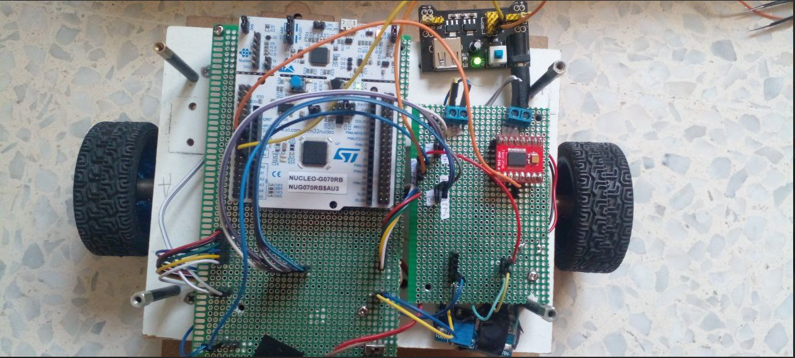
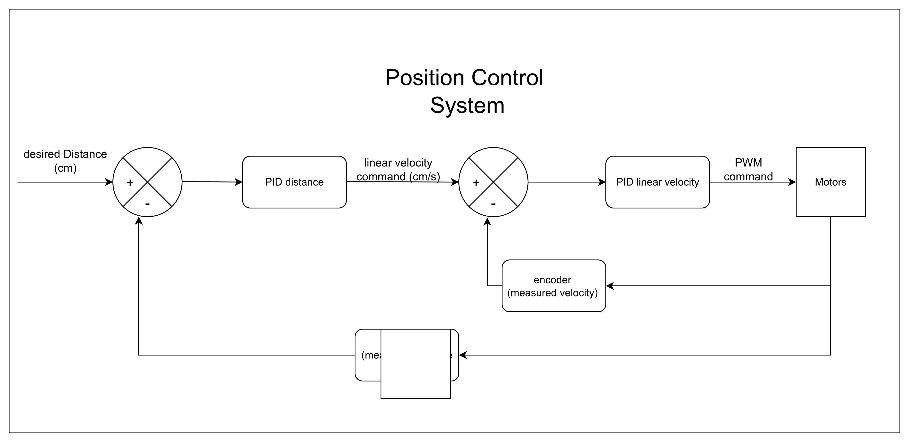
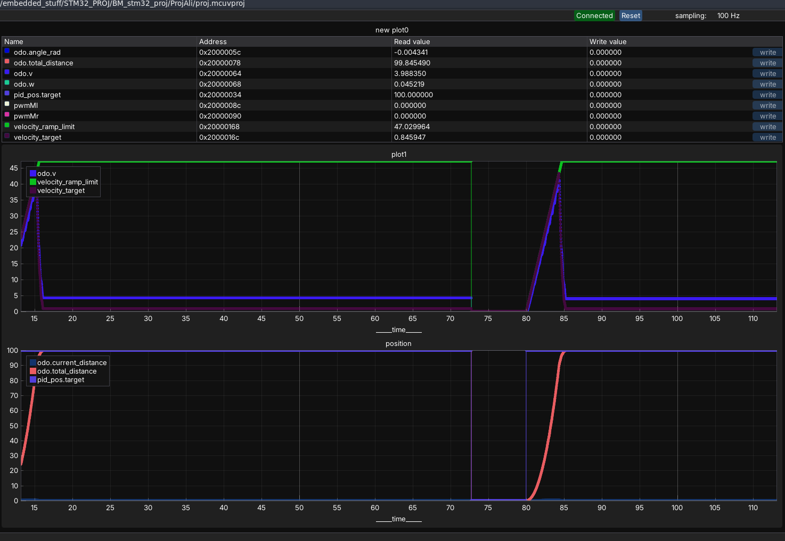
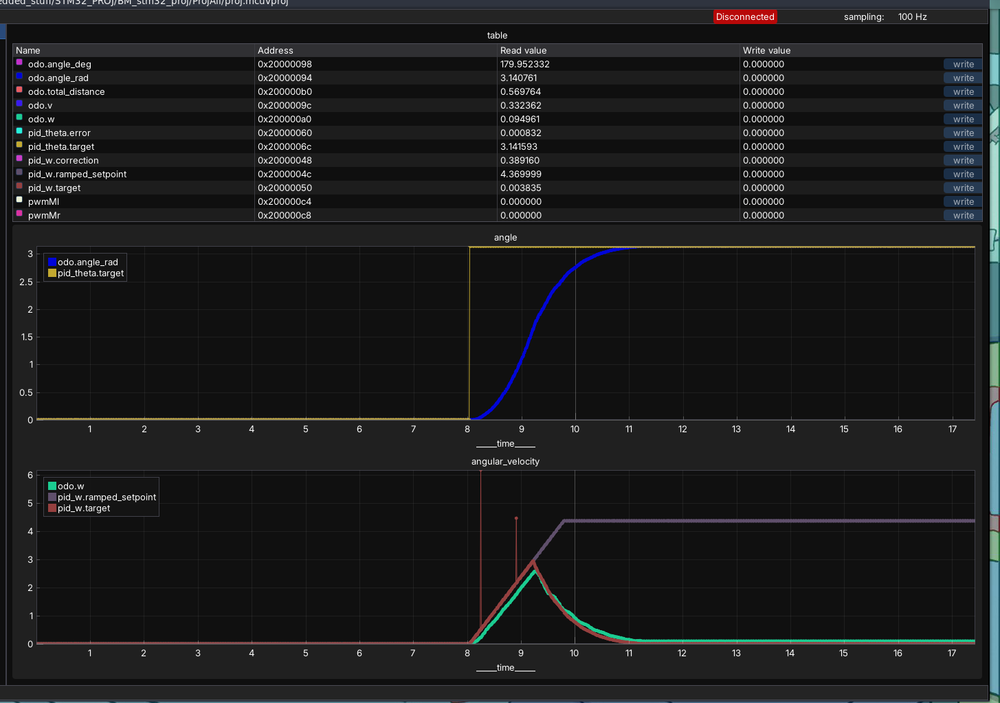
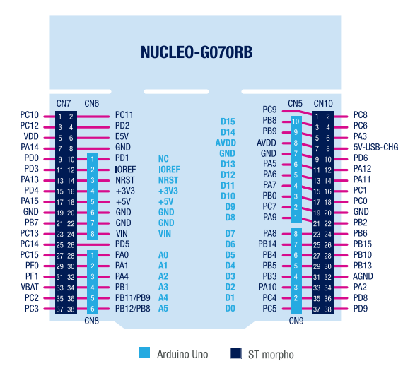
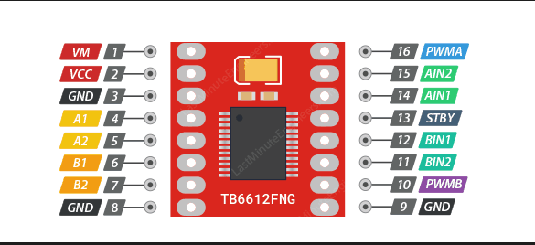

# OdometryRobot (HAL)


## Project Overview

**OdometryRobot** is a mobile robotics project focused on **precise motion control and odometry estimation** using a **bare-metal STM32 microcontroller**.

The robot executes a sequence of high-level movement commands (distance and angle) and reconstructs its trajectory using **encoder-based odometry** .

---

## Example of Input Commands

The robot receives a sequence of movement instructions such as:

```text
Forward : 100 m
Right   : 90°
Forward : 100 m
Right   : 90°
Forward : 100 m
Left    : 90°
```

Using this sequence, the robot generates a trajectory and continuously estimates its **position**, **orientation**, and **velocity** through odometry.

---

## System Architecture

The system is divided into two main parts: **Hardware** and **Control System**.

### Hardware

#### Motors with Encoders

* Provide wheel rotation feedback
* Used for velocity and distance estimation

#### Microcontroller

* **STM32G0** as the main MCU
* HAL
* Responsible for:

  * Real-time motor control
  * Odometry computation
  * Control system

---

## STM32  Software Design

All drivers and control modules are implemented using **HAL**

#### Encoder Module

* Quadrature decoding using hardware timers (encoder mode)
* Measures wheel speed and traveled distance

#### UART Module

* Bare-metal UART implementation
* Used for command reception and data transmission

#### Clock and System Configuration

* RCC and system clock configuration
* Peripheral initialization without HAL

#### Motor Control Module

* PWM generation using timers
* Direction and speed control of DC motors

---
## Control Algorithms

### Position and Angular PID Control

The robot utilizes a **dual cascaded PID architecture**, featuring separate control loops for **linear position** and **angular orientation**. This structure improves stability, smoothness, and tracking accuracy.



#### Position Control Cascade

* **Outer Loop (Position PID)**:

  * Controls the absolute target position (distance)
  * Computes the desired linear velocity setpoint

* **Inner Loop (Linear Velocity PID)**:

  * Regulates the wheel-driven linear velocity
  * Ensures smooth motion and accurate distance tracking

This cascade structure allows the robot to reach target distances precisely while avoiding abrupt speed changes.

#### Angular Control Cascade

* **Outer Loop (Angle PID)**:

  * Maintains the desired heading angle
  * Generates an angular velocity reference

* **Inner Loop (Angular Velocity PI)**:

  * Regulates rotational speed
  * Minimizes oscillations and overshoot during turns

This approach provides stable and smooth rotational motion, especially during sharp angle changes.

---

## Odometry Module

The odometry module is responsible for estimating the robot’s motion state in real time. It computes:

* Linear velocity
* Angular velocity
* Robot position (**x, y** coordinates)
* Robot orientation (angle in **radians** and **degrees**)
* Total distance traveled

These estimates are derived from:

* Wheel encoder measurements
* Inertial data (accelerometer and gyroscope)

---

## Velocity Ramping System

A critical aspect of motion control is the implementation of **velocity ramping** for both **linear** and **angular** velocities. This system ensures smooth acceleration and deceleration, which is essential for the following reasons:

* **Prevents wheel slipping**: Sudden acceleration can cause loss of traction, especially on smooth surfaces
* **Reduces mechanical stress**: Gradual velocity changes reduce stress on motors, gears, and mechanical components
* **Improves energy efficiency**: Smooth acceleration profiles consume less power than abrupt movements
* **Enhances system stability**: Prevents overshoot and oscillations in the control loops
* **Increases position accuracy**: Smooth transitions lead to more precise trajectory tracking

### Ramping Strategy

The ramping system is implemented for both **linear velocity** (`odo.v`) and **angular velocity** (`odo.w`) using a two-stage approach:

1. **Ramp-Limited Setpoint**

   * A gradually increasing velocity limit
   * Prevents sudden jumps in commanded speed

2. **Target Capping**

   * Ensures commanded velocities never exceed physical or safety constraints

### Achieved Results

The velocity ramping system provides:

Linear Velocity Ramping Performance:


Angular Velocity Ramping Performance:



* Smooth acceleration from rest to target velocity
* Controlled deceleration when approaching target positions
* Elimination of velocity spikes that could destabilize the control system
* Consistent performance across both linear and angular motion

> for visualization i used MCUViewer [link](http://github.com/klonyyy/MCUViewer)


---

## Pinout

### LED

* Internal LED: **PA5**

### H-Bridge (Motor Driver) TB6612FNG

| Signal | Pin      | Note            |
| ------ | -------- | --------------- |
| AIN1    | PB3 (D3) | Motor direction |
| AIN2    | PB5 (D4) | Motor direction |
| BIN1    | PB4 (D5) | Motor direction |
| BIN2    | PB1 (A3) | Motor direction |

| Enable            | Pin | Timer           |
| ----------------- | --- | --------------- |
| PWMA (Left Motor)  | PC1 | TIM15_CH1 (PWM) |
| PWMB (Right Motor) | PC2 | TIM15_CH2 (PWM) |

- Standby pin shoud be enabled 
- VM: main power (4.5 , 13.5V ) 
- VCC: power for the internal logic circuiuts (2.7 , 5V ) mainly 5V

> Current PWM frequency configuration is 10Khz 
---

### Encoders

#### Left Encoder

* OUTA: **PA8 (D7)** – TIM1_CH1 (Encoder mode)
* OUTB: **PA9 (D8)** – TIM1_CH2 (Encoder mode)

#### Right Encoder

* OUTA: **PC7 (D9)** – TIM3_CH2 (Encoder mode)
* OUTB: **PC6** – TIM3_CH1 (Encoder mode)

---

### UART Communication

#### UART3 (ESP32 Communication)

* TX: **PB8**
* RX: **PB9**

#### UART2

* TX: **PA2**
* RX: **PA3**

---

## Encoder Wiring

| Wire Color | Signal  |
| ---------- | ------- |
| Red        | Motor + |
| Black      | Motor − |
| Green      | GND     |
| Blue       | Vcc     |
| Yellow     | OUTA    |
| White      | OUTB    |

---


## Pinouts 



